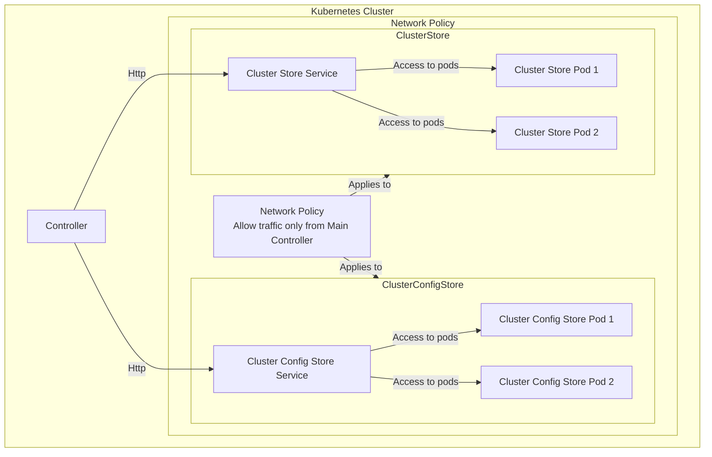

# User Manual for External Config Operator

## Overview
The External Config Operator is a Kubernetes operator designed to manage external configuration sources and integrate them seamlessly into Kubernetes clusters. It provides a streamlined mechanism for discovering and syncing configurations via an HTTP-based provider or other supported backends.

## Architecture overview:

